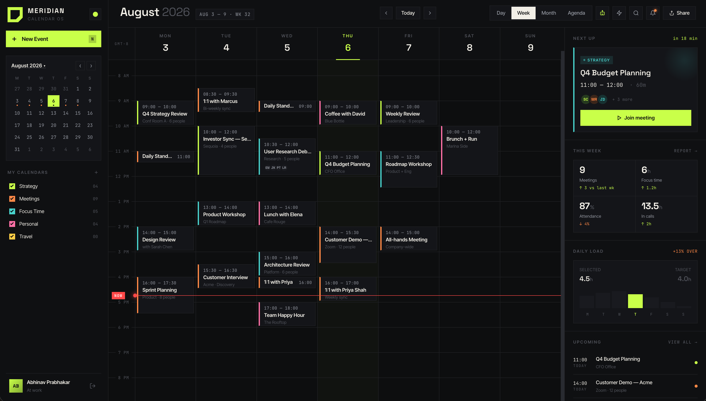

<div align="center">

  <!-- Project Icon / Logo -->
  <p align="center">
    <samp>
      
    </samp>
  </p>

  <!-- Centered Title & Subtitle -->
  <h1>⚡ MERIDIAN</h1>
  <p><b>The Next-Generation Calendar Operating System</b></p>

  <!-- High-Impact Tagline -->
  <p align="center">
    <i>Orchestrate your time. Capture events from every chat app. Coordinate availability across teams.</i>
  </p>

  <!-- Badges -->
  <p align="center">
    <a href="https://github.com/Abhinav-Prabhakar/Meridian">
      
    </a>
    <a href="https://supabase.com">
      
    </a>
    <a href="#">
      
    </a>
    <a href="https://github.com/Abhinav-Prabhakar/Meridian/blob/main/LICENSE">
      
    </a>
  </p>

  <!-- Quick Navigation -->
  <p align="center">
    <a href="#📸-product-showcase">Showcase</a> •
    <a href="#✨-core-value-propositions">Core Values</a> •
    <a href="#🔥-key-features">Features</a> •
    <a href="#-quick-start">Quick Start</a> •
    <a href="#-keyboard-shortcuts">Shortcuts</a>
  </p>

</div>

---

### 🪐 What is Meridian?

**Meridian** is a high-performance, keyboard-first calendar operating system engineered for professionals and teams who plan at scale. 

By fusing the **Caspian SDK**, **Groq's ultra-low latency GPT-OSS-120b**, and **Supabase**, Meridian acts as an ambient scheduling intelligence. It continuously monitors your communication channels (Slack, Telegram, Discord, Email), instantly extracting messy, unstructured natural language into a beautifully organized, conflict-free timeline.

No more manual data entry. No more context switching. Just pure temporal flow.

---

## 📸 Product Showcase

<p align="center">
  
</p>

---

## ✨ Core Value Propositions

### 1. Unified Event Capture Across All Chat Apps
Never manually copy event details from a chat thread into your calendar again. Meridian connects your agent identity to **Telegram**, **Email**, **Slack**, and **Discord** via the Caspian SDK and Groq's ultra-fast `GPT-OSS-120b` engine.
- Simply text your Telegram bot: *"Schedule a Q4 strategy sync tomorrow at 3pm for 90 minutes"*
- Meridian automatically parses the date, time, duration, and category, and syncs it instantly to your central calendar view.

### 2. Frictionless Team & Co-Worker Availability Discovery
Find open time slots and check when your co-workers are free without tedious back-and-forth messaging.
- Meridian intelligently computes shared free windows across team members while protecting private event details.
- Ask the AI assistant or inspect the team availability grid to book instant, non-conflicting meeting slots.

---

## 🔥 Key Features

- **⚡ Unified Communication Gateway (Caspian SDK)**: One unified AI identity handling messages from Telegram, Email, Slack, Discord, and Web Chat.
- **🤖 Groq GPT-OSS-120b Engine**: Lightning-fast natural language scheduling, full CRUD calendar actions (Add, Edit, Remove, Query), and Markdown response formatting.
- **📷 Image Drag-and-Drop Assistant**: Drag and drop screenshots, flyers, or meeting invites directly into the AI Assistant drawer for instant visual context.
- **📅 10-Minute Snapping & Interactive Resizing**: Precision calendar drag-and-drop moving and bottom handle dragging that snaps to every 10 minutes.
- **🎨 Inline Custom Calendars**: Create personalized calendars with custom color swatches directly in the sidebar with zero modal popups.
- **🔒 Supabase Auth & Database**: 256-bit encrypted authentication (Email + Google OAuth) with Row Level Security (RLS) policies protecting user data.
- **🌙 Glassmorphic Dark Aesthetics**: Sleek atmosphere lighting, customizable theme accent colors, live clock tickers, and responsive keyboard navigation (`N` for New Event, `B` for AI Assistant, `I` for Integrations).

---

## 🚀 Quick Start

### Prerequisites
- Node.js 18+ & npm
- [Supabase CLI](https://supabase.com/docs/guides/cli) (optional for local DB migrations)
- Groq API Key (for `GPT-OSS-120b` AI engine)

### 1. Clone & Install Dependencies
```bash
git clone https://github.com/Abhinav-Prabhakar/Meridian.git
cd meridian
npm install
```

### 2. Set Up Environment Variables
Create a `.env.local` file in the project root:
```env
NEXT_PUBLIC_SUPABASE_URL=https://your-project.supabase.co
NEXT_PUBLIC_SUPABASE_ANON_KEY=your-anon-key
GROQ_API_KEY=gsk_your_groq_api_key
```

### 3. Run Development Server
```bash
npm run dev
```
Open [http://localhost:3000](http://localhost:3000) in your browser to start orchestrating your time.

---

## ⌨️ Keyboard Shortcuts

| Shortcut | Action |
|---|---|
| `N` or `C` | Create New Event |
| `B` | Open AI Assistant Drawer |
| `I` | Open App & Bot Integrations |
| `T` | Jump to Today |
| `D` / `W` / `M` / `A` | Switch to Day / Week / Month / Agenda View |
| `/` or `S` | Search Events |
| `P` | Open Theme Color Customizer |
| `Esc` | Close Drawer / Modal |

---

## 🛡️ License

Built with ❤️ by the Meridian Team. Distributed under the MIT License.
